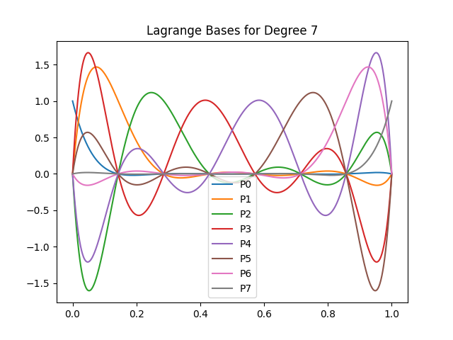
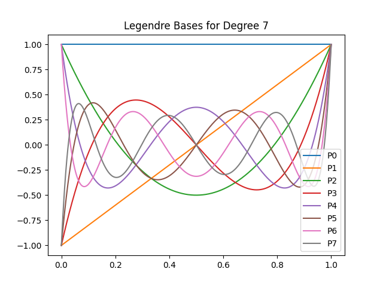
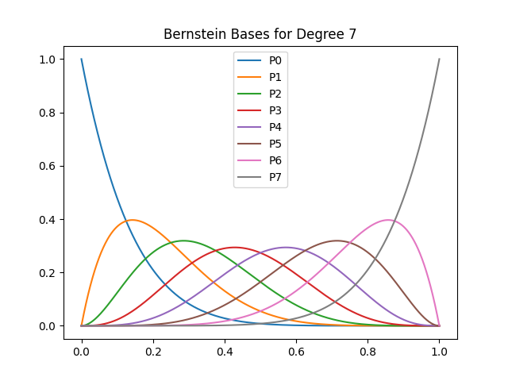

# tcore
Library of my helper functions used as a submodule in various projects. Includes generators for numerical quadratures, generators for basis functions for finite element methods, time integration methods, and some OpenGL helpers for rendering and GPGPU.

